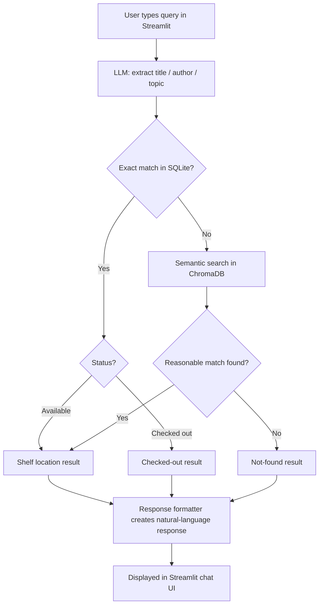

# Library Book Finder Assistant

**CAP 942 Capstone Project**

## Overview

An AI assistant that helps students find books in the library using natural language. Instead of knowing an exact title or call number, a student can ask a question like "do you have anything on World War II?" and get pointed to the right shelf.

**Problem it solves:** Students often know a topic or rough title but not the shelf location, and library staff spend time answering repetitive location questions.

**Intended users:** Students and work-study library staff.

## MVP Scope

The MVP is text-only (no voice) and includes exact, author, and topical search across a 234-book catalog.

**In scope (MVP), all implemented:**
- Text input from the user
- LLM-based intent extraction (title / author / topic)
- Case-insensitive partial title/author lookup against a library catalog (SQLite), including multiple matches
- Fuzzy/topical fallback search (semantic search via ChromaDB) when there's no exact match
- Deterministic natural-language response with shelf location and match count
- Generic handling for "not found" and "checked out" cases; if multiple matches exist, returns one and reports the count
- Graceful error handling if the local LLM service is unreachable
- Structured timing logs for LLM, database, semantic-search, and end-to-end query performance

**Out of scope for now (future iterations):**
- Voice input (speech-to-text)
- Text-to-speech output
- Live integration with the school's real library system (ILS)

## Tech Stack

| Component | Tool | Purpose |
|---|---|---|
| LLM | Ollama (Llama 3.2 3B) | Extracts search intent from user text |
| Structured catalog | SQLite | Stores title, author, subject, shelf, copies, and availability |
| Semantic search | ChromaDB | Embeds book subjects for topical queries with no exact match |
| Data loading | pandas | Reads the 234-book seed CSV into the catalog |
| Catalog source | Open Library Subjects API | Supplies subject-tagged books for the expanded catalog |
| App framework | Streamlit | Cached chat-style UI with conversation history |
| Logging | Python `logging` | Reports query-path and component timings |
| Dependency management | uv | Project setup and dependency management |

## Setup

Prerequisites: Python 3.14+, [Ollama](https://ollama.com) installed locally, and [uv](https://docs.astral.sh/uv/) for Python dependency management.

```bash
# pull the local LLM
ollama pull llama3.2

# clone and set up the project
git clone <this-repo-url>
cd AI-Solution-Developer-Capsone-Project
uv sync
```

The repository includes the expanded `BooksCatalog.csv`. To fetch a fresh expanded catalog from Open Library, run:

```bash
uv run python FetchOpenLibrary.py
```

This writes `BooksCatalogExpanded.csv`. Review the generated file before replacing `BooksCatalog.csv`, then reseed the local databases.

## Running the App

1. Make sure Ollama is running and the model is pulled (see Setup above).
2. Seed the SQLite catalog and ChromaDB collection (run once, or whenever `BooksCatalog.csv` changes):
   ```bash
   uv run python seed_data.py
   ```
3. Launch the app:
   ```bash
   uv run streamlit run app.py
   ```
4. Open the browser tab Streamlit opens automatically (usually `localhost:8501`) and type a question. The chat history remains visible during the session.

## Example Queries

**Exact title match:**
> Q: "do you have 1984?"
> A: "1984" by George Orwell is available on the Fiction shelf.

**Exact author match, checked out:**
> Q: "do you have anything by Rachel Carson?"
> A: "Silent Spring" by Rachel Carson is currently checked out.

**Topical/semantic fallback:**
> Q: "something about ancient military strategy"
> A: "The Art of War" by Sun Tzu is available on the Nonfiction History shelf.

**Not found:**
> Q: "purple elephant recipes"
> A: Sorry, I couldn't find anything matching that in our catalog.

## Workflow Diagram



## Project Structure

```
AI-Solution-Developer-Capsone-Project/
├── app.py              # Streamlit UI: collects user queries, displays results
├── search.py            # Core logic: LLM calls, intent extraction, exact match,
│                          semantic search, orchestration, response formatting
├── seed_data.py          # One-time setup: loads BooksCatalog.csv into SQLite and ChromaDB
├── FetchOpenLibrary.py   # Optional: fetches an expanded catalog from Open Library
├── config.py             # Shared constants (file paths, collection name)
├── BooksCatalogExpanded.csv # Expanded catalog from Open Library and orgiginal Books.csv dataset
├── catalog.db            # Generated by seed_data.py (not committed to git)
├── chroma_db/            # Generated vector store (not committed to git)
├── pyproject.toml        # uv-managed dependencies
├── uv.lock               # uv's lockfile
└── README.md
```

## Known Limitations

- Uses sample/seed data (234 books sourced from Open Library), not the school's real, live library system (ILS). This is a prototype, not production-ready for real students without further integration work.
- Intent classification relies on the LLM (Llama 3.2 3B) interpreting free text, which isn't perfectly deterministic. The same query can occasionally be classified differently between runs. `search_catalog` mitigates this by always checking for a title/author match first, regardless of the LLM's classification, before falling back to semantic search.
- If Ollama's background service is unreachable, the app shows a generic "temporarily unavailable" message rather than a specific error. This covers connection failures but doesn't distinguish between different failure types (e.g., model not found vs. service down).
- Semantic search returns the single closest match above a fixed similarity threshold (tuned at 1.0 based on testing). It does not rank or return multiple topic matches.
- No voice input/output. Chat history is displayed during the Streamlit session, but each query is handled independently and there is no conversational context passed to the LLM.