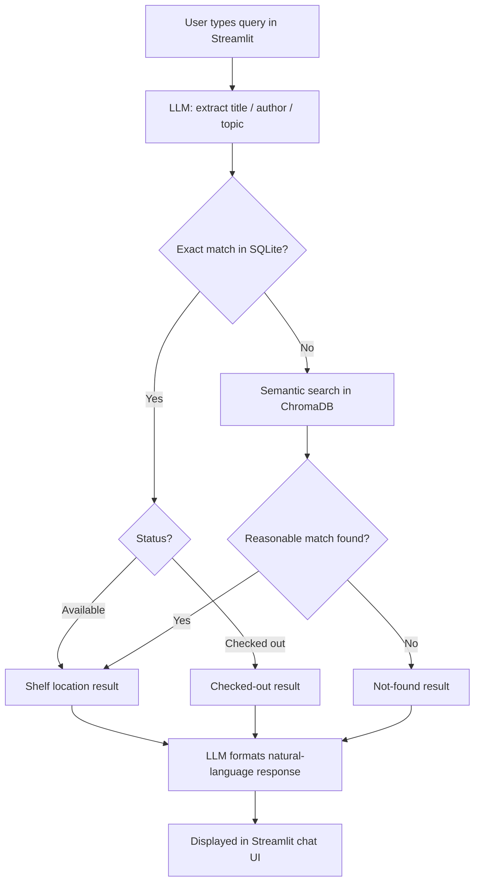

# Library Book Finder Assistant

**CAP 942 Capstone Project**

## Overview

An AI assistant that helps students find books in the library using natural language. Instead of knowing an exact title or call number, a student can ask a question like "do you have anything on World War II?" and get pointed to the right shelf.

**Problem it solves:** Students often know a topic or rough title but not the call number or shelf location, and library staff spend time answering repetitive location questions.

**Intended users:** Students and work-study library staff.

## MVP Scope

The MVP is text-only (no voice) and includes both exact and topical search.

**In scope (MVP), all implemented:**
- Text input from the user
- LLM-based intent extraction (title / author / topic)
- Exact-match lookup against a library catalog (SQLite)
- Fuzzy/topical fallback search (semantic search via ChromaDB) when there's no exact match
- Natural-language response with shelf location
- Generic handling for "not found" and "checked out" cases; if multiple copies exist, returns one
- Graceful error handling if the local LLM service is unreachable

**Out of scope for now (future iterations):**
- Voice input (speech-to-text)
- Text-to-speech output
- Live integration with the school's real library system (ILS)

## Tech Stack

| Component | Tool | Purpose |
|---|---|---|
| LLM | Ollama (Llama 3.2 3B) | Extracts search intent from user text and formats the final response |
| Structured catalog | SQLite | Stores title, author, subject, call number, shelf, copies, availability |
| Semantic search | ChromaDB | Embeds book subjects for topical queries with no exact match |
| Data loading | pandas | Reads the seed CSV into the catalog |
| App framework | Streamlit | Chat-style UI |
| Dependency management | uv | Project setup and dependency management |

## Setup

Prerequisites: [Ollama](https://ollama.com) installed locally, and [uv](https://docs.astral.sh/uv/) for Python dependency management.

```bash
# pull the local LLM
ollama pull llama3.2

# clone and set up the project
git clone <this-repo-url>
cd AI-Solution-Developer-Capsone-Project
uv sync
```

## Running the App

1. Make sure Ollama is running and the model is pulled (see Setup above).
2. Seed the database (only needs to be run once, or whenever `BooksCatalog.csv` changes):
   ```bash
   uv run python seed_data.py
   ```
3. Launch the app:
   ```bash
   uv run streamlit run app.py
   ```
4. Open the browser tab Streamlit opens automatically (usually `localhost:8501`) and type a question.

## Example Queries

**Exact title match:**
> Q: "do you have 1984?"
> A: The book "1984" by George Orwell is currently available in the library with a call number of PR6029.R8 N4.

**Exact author match, checked out:**
> Q: "do you have anything by Rachel Carson?"
> A: "Silent Spring" by Rachel Carson is currently checked out and can be found on Science shelf 570-579.

**Topical/semantic fallback:**
> Q: "something about ancient military strategy"
> A: "The book 'The Art of War' by Sun Tzu is currently available on the shelf in Nonfiction 350-359."

**Not found:**
> Q: "purple elephant recipes"
> A: Unfortunately, the information we have doesn't seem to be available right now.

## Workflow Diagram



## Project Structure

```
AI-Solution-Developer-Capsone-Project/
├── app.py              # Streamlit UI: collects user queries, displays results
├── search.py            # Core logic: LLM calls, intent extraction, exact match,
│                          semantic search, orchestration, response formatting
├── seed_data.py          # One-time setup: loads BooksCatalog.csv into SQLite and ChromaDB
├── config.py             # Shared constants (file paths, collection name)
├── BooksCatalog.csv      # 25 sample books (title, author, subject, call number,
│                           shelf, copies, status)
├── catalog.db            # Generated by seed_data.py (not committed to git)
├── chroma_db/            # Generated vector store (not committed to git)
├── pyproject.toml        # uv-managed dependencies
├── uv.lock               # uv's lockfile
└── README.md
```

## Known Limitations

- Uses sample/seed data (25 hand-curated books), not the school's real, live library system (ILS). This is a prototype, not production-ready for real students without further integration work.
- Intent classification relies on the LLM (Llama 3.2 3B) interpreting free text, which isn't perfectly deterministic. The same query can occasionally be classified differently between runs. `search_catalog` mitigates this by always checking for an exact title/author match first, regardless of the LLM's classification, before falling back to semantic search.
- If Ollama's background service is unreachable, the app shows a generic "temporarily unavailable" message rather than a specific error. This covers connection failures but doesn't distinguish between different failure types (e.g., model not found vs. service down).
- Semantic search returns the single closest match above a fixed similarity threshold (tuned at 1.0 based on testing). It does not rank or return multiple topic matches.
- No voice input/output, and no multi-turn conversation memory. Each query is handled independently.